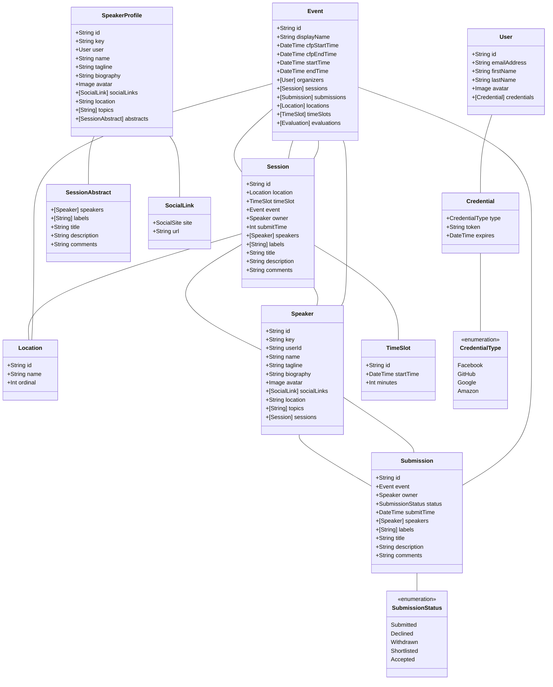

# Platform Specs

This folder contains the platform's specifications in Gherkin format.

## Features

The platform contains the following high-level features:

- [Attendee Scheduling](./features/AttendeeSchedules/) (aka "My Schedule"): ability for attendees to build a custom view of the schedule (i.e. plan the sessions they wish to attend)
- [Evalutations](./features/Evalutations/): Events, Session, and Speaker evaluations
- [Events](./features/Events/): instances of a given Event (aka Conference)
- [Scheduling](./features/Schedules/): ability to schedule Sessions in an Event
- [Sessions](./features/Sessions/): ability to manage approved/accepted Speaker Submissions
- [Speakers](./features/Speakers/): ability to manage the folks who present Sessions
- [Sponsors](./features/Sponsors/): ability to manage Event Sponsors
- Submissions: ability to track and evaluate Speaker submissions (aka not yet accepted Sessions)
- [Teams](./features/Teams/): ability to manage Teams of Users (aka Organizers of a conference)
- [Users](./features/Users/): ability to manage Users and their Roles

## Users / Roles

- System Admin: the superusers of the system
- Organizer
- Event Administrator
- User: any authenticated user
- Anonymous Viewer: any unauthenticated user

## Concepts

- Event / Conference: an instance of a specific event, e.g. TechBash 2019
- Teams: Groups of people (aka Organizers) that manage a given Event

## Domain Architecture

